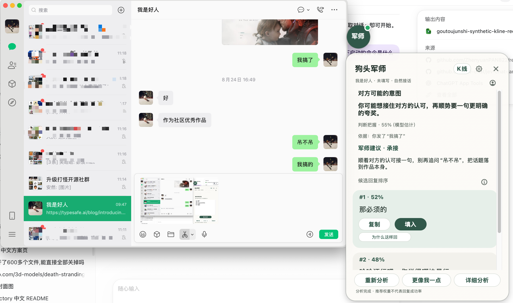
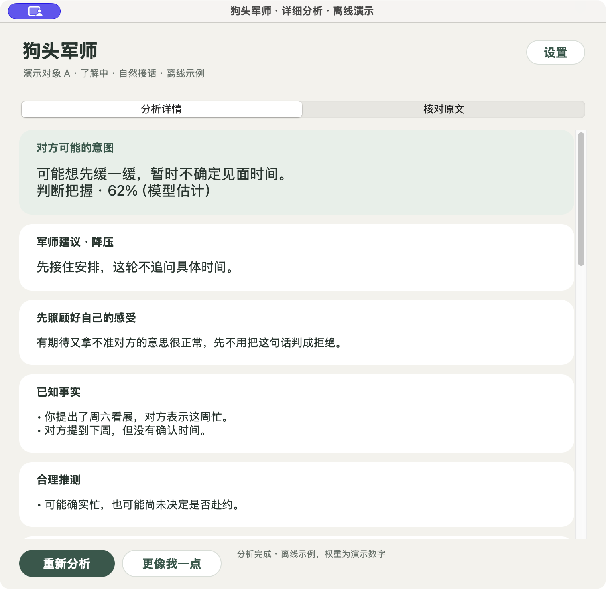
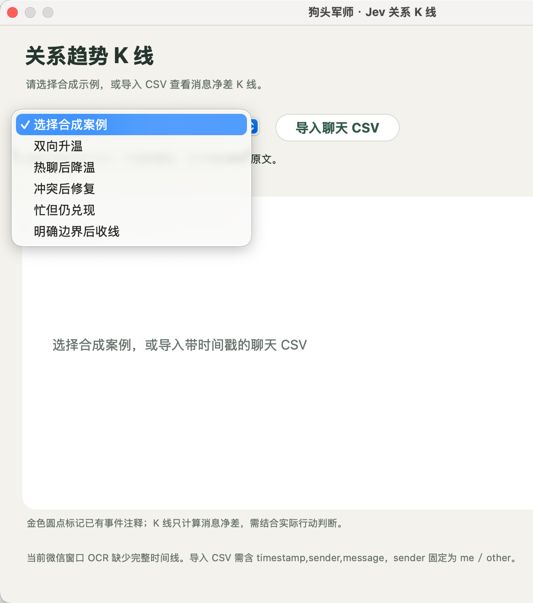
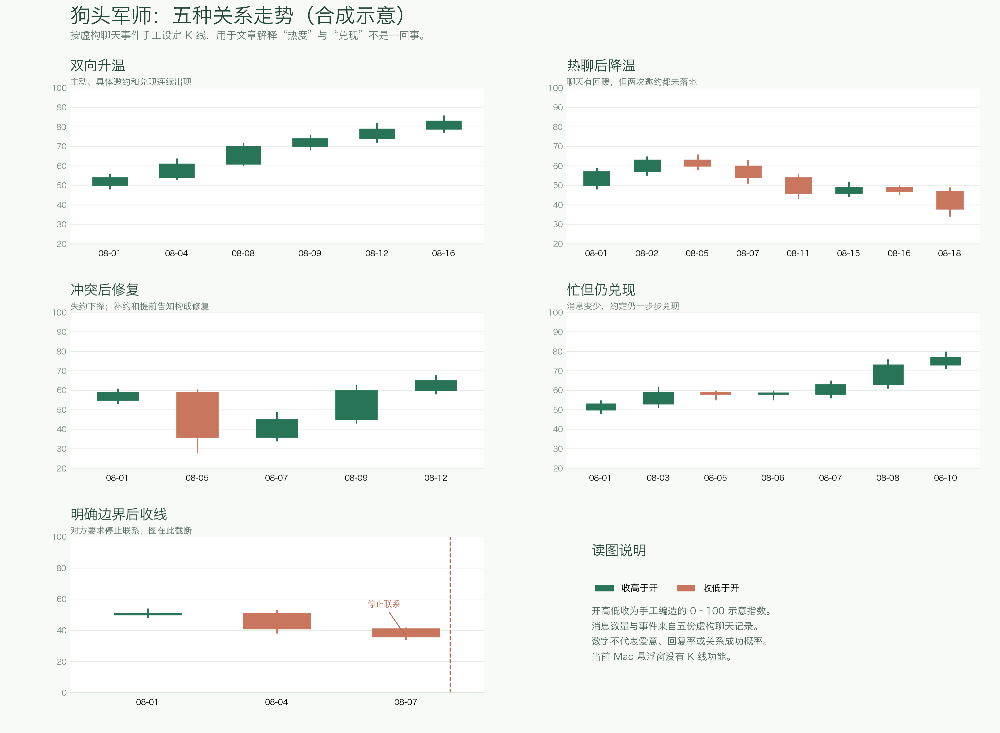
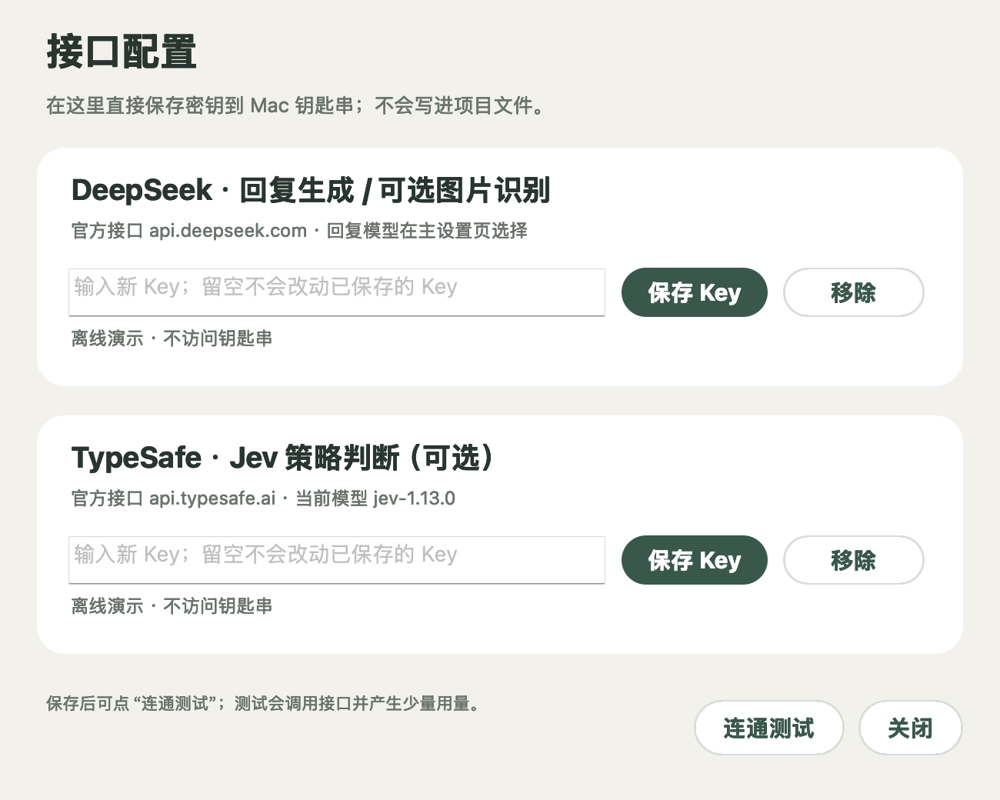

<!-- README_SYNC: source=working-tree; updated=2026-09-24 -->

<p align="center"><a href="./README.md">简体中文</a> · English</p>

# Goutoujunshi Jev Chat

**Goutoujunshi beside your chat window: screen reading, analysis, and reply drafts.** This standalone project builds on [Goutoujunshi](https://github.com/shengjidaguai-china/goutoujunshi). The Mac workflow is implemented; the Android debug APK and Windows preview ZIP now pass automated builds, but still need testing on their respective devices. Sending remains your decision on every platform.

If it helps you, [Star the project](https://github.com/shengjidaguai-china/goutoujunshi-jev-chat/stargazers) so you can find it again and help others discover it.

## Preview packages for three platforms

Open the latest successful run on the [GitHub Actions build page](https://github.com/shengjidaguai-china/goutoujunshi-jev-chat/actions/workflows/platform-build.yml) and download the Artifacts at the bottom. The Android artifact is an outer ZIP containing the APK. Extract the full Windows ZIP before launching its executable.

| Platform | Artifact | Current status |
| --- | --- | --- |
| macOS | `goutoujunshi-jev-chat-mac-source` | Source ZIP. Run `安装依赖.command`, then `离线演示.command` or `启动.command`. Requires Python 3.12 and uv; there is no signed `.app`. |
| Android | `goutoujunshi-jev-chat-android-debug` | Debug APK. Automated build and unit tests pass; Android device validation is pending. |
| Windows | `goutoujunshi-jev-chat-windows-preview` | Executable-directory ZIP. Automated build passes; Windows device validation is pending. |

The screenshots and full transcript review, relationship profiles, and candlestick view below are from the Mac version. Android and Windows include chat capture, Jev judgment, and reply drafting, but those full screens have not been ported. See the [Android guide](integrations/jev_android/README.md) and [Windows guide](integrations/jev_windows/README.md).

## Screenshots

These screenshots show the Mac version. Synthetic demo data is labeled separately from live captures.

### Overlay beside WeChat



*Desktop screenshot supplied by the author. The panel shows a possible intent, the model's confidence estimate, evidence from the visible chat, and ranked reply drafts. The 52% and 48% values are relative recommendation weights for this set of drafts. “Copy” puts a draft on the clipboard; “Fill” inserts it into the current chat draft. You choose whether to send it.*

### Detailed analysis



*Offline synthetic demo. The detail view separates possible intent, advice, your own feelings, observed facts, and reasonable hypotheses. The transcript tab lets you check the recognized text before analysis. The 62% shown here is a model self-assessment for its intent hypothesis, not a validated probability.*

### Relationship candlestick window



*Click “K-line” at the top of the overlay to open the relationship trends window. The menu offers five patterns, and you can import a chat CSV to explore how the chart changes over time.*

### Five illustrative patterns



*Five relationship patterns: mutual warming, cooling after intense chat, repair after conflict, a busy but reliable partner, and drawing a line after a clear boundary. Follow the changes along the timeline, then compare each turning point with the chat event behind it.*

## One round of use

1. Open the target conversation in WeChat for Mac and click “Read conversation” in the overlay.
2. Check the recognized text, speakers, relationship stage, and your goal before confirming analysis.
3. Review the possible intent, confidence estimate, evidence, advice, and ranked reply drafts. Open “Detailed analysis” for facts, hypotheses, unknowns, next steps, and stop conditions.
4. Copy a draft or fill the verified chat input. You decide when and whether to send it.

**Apple Vision** performs local text recognition by default. You can opt into **DeepSeek image recognition**; that mode sends a cropped chat screenshot to DeepSeek and incurs API usage. DeepSeek or a configured OpenAI-compatible endpoint generates reply drafts. **TypeSafe Jev is an optional strategy layer**: when enabled, it chooses a strategy before the reply model generates drafts. The two API keys are configured separately through the UI and stored in dedicated Mac Keychain entries. No real keys are included in this repository.

Intent confidence is the reply model's uncalibrated self-assessment. Candidate percentages are relative recommendation weights within the current set of drafts. Neither is a verified probability of intent, reply rate, or relationship outcome. The app shows an unknown state when the evidence is insufficient.

## What makes it different

- **Replies in your style:** It uses only verified messages attributed to you in the current conversation. “More like me” revises the current drafts without training a model or borrowing text from other conversations.
- **Reasons and trade-offs:** Expand each candidate to see why it fits and what it costs. Advice includes an observation window and a stop condition.
- **Opt-in relationship profiles:** With explicit consent, the app stores limited background details. You can inspect, pause, undo, or delete them. It does not store the full chat.
- **Charts with stated rules:** Five example patterns are included. For an imported CSV, the chart tracks daily message-direction balance. Neither chart measures love or relationship quality.
- **Human control:** OCR results are reviewed first, automatic analysis starts off, and the chat is checked again before filling. The app does not press Send.

## Install and run

Requires macOS, Python 3.12, and [`uv`](https://docs.astral.sh/uv/). From the repository root:

```bash
cd integrations/jev_mac
uv venv --python 3.12 .venv
uv pip install --python .venv/bin/python -r requirements.txt
./start.command --demo
```

`--demo` uses a synthetic conversation and stays offline: it neither reads WeChat nor calls a model. For real use, run `./start.command`. Run `./start.command --settings` to open settings directly, then use “Interfaces and models → Configure interfaces” to save a DeepSeek key and, optionally, a TypeSafe Jev key. Grant the launching terminal macOS Screen Recording permission. Filling a draft also requires Accessibility permission.



*Offline preview of the provider settings. DeepSeek and Jev keys are saved separately. Stored values are never shown in the form, and this image contains no real key.*

For models, OCR choices, Keychain and environment configuration, CSV format, and operating limits, see the [Mac usage guide](integrations/jev_mac/README.md) (Chinese).

## Verification and status

As checked on September 24, 2026: 79 Python tests passed; all three automated platform builds passed; and the Mac ZIP was extracted, its dependencies installed, and its offline demo launched. To repeat the local checks:

```bash
python3 -B scripts/validate_skill.py
python3 -B -m unittest discover -s tests -q
```

These are **preview builds**. Live WeChat capture, model requests, and Accessibility filling on Mac were not repeated in this offline check. Android and Windows still need device-level checks of capture, overlay, and filling against actual chat app versions. An incomplete Jev judgment stops reply drafting; Android retains drafts with a “ranking pending” label if ranking fails. Windows filling uses window coordinates: it checks the current chat and foreground window, but cannot read back the input control. Copy and paste manually when the target is uncertain. Cloud image recognition and analysis send relevant content to the configured services. See the [data-use notice](PRIVACY.md).

The repository bundles Goutoujunshi's behavior rules and selected knowledge. Its original code uses the [MIT License](LICENSE). Mac window modules are adapted from [jev-chat-jarvis-mac](https://github.com/jev-chat/jev-chat-jarvis-mac), with its MIT notice in [vendor/LICENSE](integrations/jev_mac/vendor/LICENSE). Android sources come from [Jev Android](https://github.com/jev-chat/jev-chat-jarvis), and Windows sources from [Jev Windows](https://github.com/jev-chat/jev-chat-windows); both retain their LICENSE and NOTICE in their directories. See the [Windows NOTICE](integrations/jev_windows/NOTICE) for the PySide6-Fluent-Widgets distribution license.
